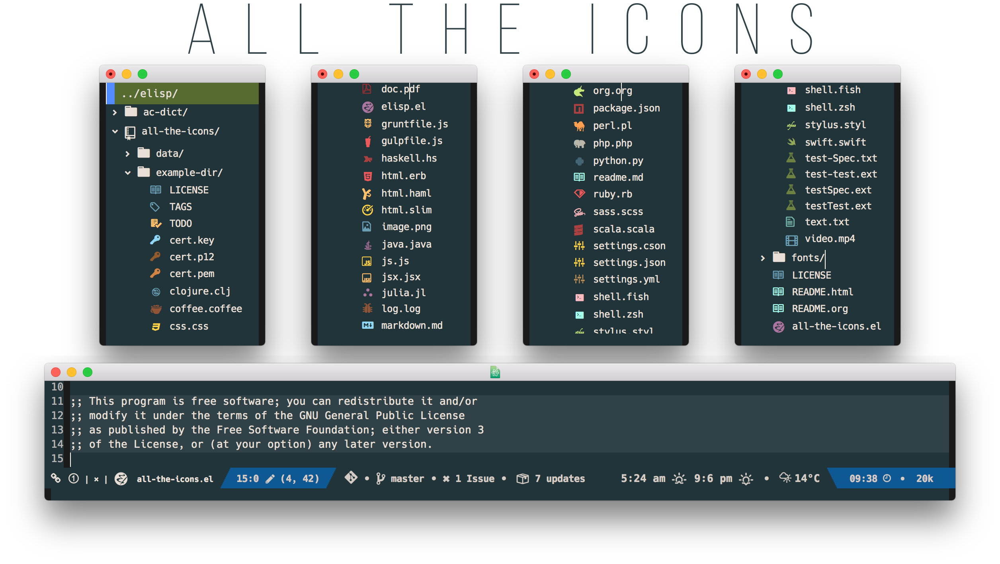

<p align="center">
<b><a href="#installation">Installation</a></b>
|
<b><a href="#usage">Usage</a></b>
|
<b><a href="#resource-fonts">Fonts</a></b>
|
<b><a href="#wiki">Wiki</a></b>
</p>

<p align="center">
  <a href="https://melpa.org/#/all-the-icons"></a>
  <a href="https://stable.melpa.org/#/all-the-icons"></a>
  <a href="https://github.com/domtronn/all-the-icons.el/releases"></a>
  <a href="https://travis-ci.org/domtronn/all-the-icons.el"></a>
  <a href="https://github.com/domtronn/all-the-icons.el/blob/master/LICENSE"></a>
</p>

# Installation

You should be able to install this package in the standard way, add it
to the load path and then calling

```el
(require 'all-the-icons)
;; or
(use-package all-the-icons)
```

### Installing Fonts

In order for the icons to work it is **very important** that you install
the Resource Fonts included in this package, they are available in the
[ `fonts` ](file:///fonts) directory. You can also install the *latest*
fonts for this package in the *(guessed?)* based on the OS by calling
the following function;

    M-x all-the-icons-install-fonts

Bear in mind, this will also run `fc-cache -f -v` on **MacOS** and
**Linux** which *can take some time* to complete. For **Windows**, this
function will prompt for a *download* directory for you to install
them manually.

# Usage

The simplest usage for this package is to use the following functions;

-   `all-the-icons-icon-for-buffer`
-   `all-the-icons-icon-for-file`
-   `all-the-icons-icon-for-mode`

Which can be used to get a formatted icon which you can insert into
buffers, *e.g.*

```el
(insert (all-the-icons-icon-for-file "foo.js"))
    ;; Inserts a javascript icon
    ;; #("js-icon" 0 1 (display (raise -0.24) face (:family "alltheicon" :height 1.08 :foreground "#FFD446")))
```

## Inserting Icons Directly

The above is fine if you want this package to automatically decide on
the icon you want for files and things, however, to insert the icons
directly you will want to use these icons functions;

-   `all-the-icons-alltheicon`
-   `all-the-icons-faicon`
-   `all-the-icons-fileicon`
-   `all-the-icons-oction`
-   `all-the-icons-wicon`

You can then call these functions with the icon you want to insert,
*e.g.*

```el
(all-the-icons-octicon "file-binary")  ;; GitHub Octicon for Binary File
(all-the-icons-faicon  "cogs")         ;; FontAwesome icon for cogs
(all-the-icons-wicon   "tornado")      ;; Weather Icon for tornado
```

A list of all the icon names for a font family can be found in the
`data` directory, or by inspecting the alist variables.

The alist variables are all prefixed with 

-   `all-the-icons-data/`

For example `C-h v all-the-icons-data/ <TAB>` will give a list of all the data
alist you can describe *(and the icon fonts they're associated with)*

## Inserting icons with properties

Each of the above icon functions can also be given different
properties to slightly adjust the way they're formatted, these are

-   `:height` - The height of the icon
-   `:v-adjust` - Vertical adjust (*positive is up, negative is down*)
-   `:face` - The face to apply to the icon, defaults to `\'default`

So you would call, for example

```el
(all-the-icons-wicon "tornado" :face 'all-the-icons-blue)
```

These properties can also be used on the `all-the-icons-icon-for-file`
and `all-the-icons-icon-for-mode` functions as well, *i.e.*

```el
(insert (all-the-icons-icon-for-file "foo.js" :height 2 :face 'all-the-icons-lred))
    ;; Inserts a RED Javascript icon with height 2
    ;; #("js-icon" 0 1 (display (raise -0.24) face (:family "alltheicon" :height 2.0 :foreground "red")))
```

## Propertizing icons yourself

However, sometimes when propertizing these icons *(for example if you
were customising your mode line)* you *may* sometimes have to know the
font family to add in to override the current font family being used,
*e.g.*

```el
(propertize (all-the-icons-octicon "package")
            'face `(:family ,(all-the-icons-octicon-family) :height 1.2)
            'display '(raise -0.1))
```

## Debugging/Displaying Icon Sets

Sometimes it can be useful to print out all of the icons in an icon
set to ensure that 

-   **(a)** they're the correct icon and
-   **(b)** what icons are available and what name they have.

There is a helper function which will print out all of the icons in an
icon set and they're corresponding id/name.

```el
(all-the-icons-insert-icons-for 'alltheicon)   ;; Prints all the icons for `alltheicon' font set

(all-the-icons-insert-icons-for 'octicon 10)   ;; Prints all the icons for the `octicon' family
                                               ;; and makes the icons height 10

(all-the-icons-insert-icons-for 'faicon 1 0.5) ;; Prints all the icons for the `faicon' family 
                                               ;; and also waits 0.5s between printing each one
```

# Resource Fonts

All of the fonts provided in this packages as resources come with
either the SIL Open Font License *(OFL)* or an MIT License, below I
will link to each of the fonts Sources and their Licenses.

| Font Name | Font | License |
| --- | --- | --- |
| `file-icons.ttf` | [Atom File Icons Plugin](https://atom.io/packages/file-icons) | [MIT LICENSE](https://github.com/DanBrooker/file-icons/blob/master/LICENSE.md) |
| `fontawesome.ttf` | [FontAwesome Icons](http://fontawesome.io/) | [SIL OFL LICENSE](https://github.com/FortAwesome/Font-Awesome#license) |
| `ocitcons.ttf` | [GitHub OctIcons](http://octicons.github.com) | [SIL OFL LICENSE](https://github.com/primer/octicons/blob/master/LICENSE) |
| `weathericons.ttf` | [Weather Icons](https://erikflowers.github.io/weather-icons/) | [SIL OFL LICENSE](https://github.com/primer/octicons/blob/master/LICENSE) |
| `material-design-icons.ttf` | [Material Icons](http://google.github.io/material-design-icons/) | [APACHE LICENSE v2.0](http://www.apache.org/licenses/LICENSE-2.0.txt) |
| `all-the-icons.ttf` | Custom Made Font | MIT LICENSE |

The fonts provided with this packages are locked down to a version for
unicode character mapping values. In the future, these may be
automatically generated.

I would like to thank all the authors for the creation and use
of these fantastic fonts.

# Wiki

Lastly, there is a
[Wiki Page](https://github.com/domtronn/all-the-icons.el/wiki) which
should give you some ideas of ways to use this library to spruce up
other Emacs packages.

### Slow Rendering

If you experience a slow down in performace when rendering multiple
icons simultaneously, you can try setting the following variable

```el
(setq inhibit-compacting-font-caches t)
```

Some people have found that this [fixes the problem](https://github.com/domtronn/all-the-icons.el/issues/28)

[▲ back to top](#readme)
